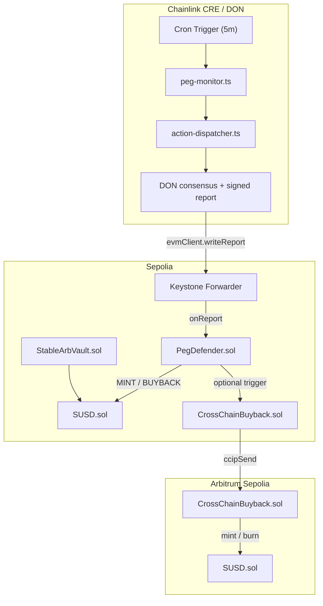
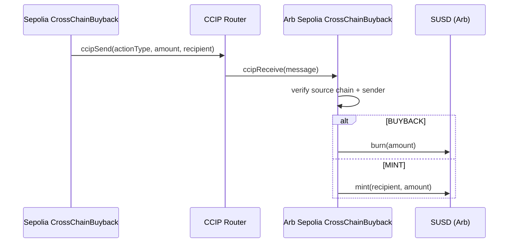

# StableArb

Autonomous multi-chain stablecoin infrastructure that combines:
- **Overcollateralized minting + liquidation** (`StableArbVault`)
- **On-chain supply controls** (`SUSD`, `PegDefender`)
- **Cross-chain supply actions** via **CCIP** (`CrossChainBuyback`)
- **Off-chain peg monitoring + decentralized action dispatch** via **Chainlink CRE** (`cre-workflow`)
- **Operator and user dashboard** (Next.js frontend)


---

## Table of Contents

- [Architecture](#architecture)
- [Repository Layout](#repository-layout)
- [Core Components](#core-components)
- [How Peg Defense Works](#how-peg-defense-works)
- [Prerequisites](#prerequisites)
- [Environment Configuration](#environment-configuration)
- [Quick Start](#quick-start)
- [Smart Contracts (Hardhat)](#smart-contracts-hardhat)
- [CRE Workflow](#cre-workflow)
- [Frontend Dashboard](#frontend-dashboard)
- [Cross-Chain (CCIP) Flow](#cross-chain-ccip-flow)
- [Deployment Runbook](#deployment-runbook)
- [Testing](#testing)
- [Verification & Observability](#verification--observability)
- [Security Notes](#security-notes)
- [Deployed Addresses](#deployed-addresses)
- [Chainlink Usage](#chainlink-usage)


---

## Architecture



---

## Repository Layout

```text
stablearb/
├─ contracts/        # Hardhat project (Solidity, tests, deploy/verify scripts)
├─ cre-workflow/     # Chainlink CRE TypeScript workflow for peg monitoring/actions
├─ frontend/         # Next.js dashboard + minting UI + API routes
├─ docs/             # Additional protocol/integration docs
├─ demo-video/       # Separate remotion/demo asset project
└─ README.md         # This file
```

---

## Core Components

### Smart Contracts (`contracts/src`)

- **`SUSD.sol`**
    - ERC-20 token (`StableArb USD`)
    - Mint/burn restricted to an authorized vault/controller

- **`StableArbVault.sol`**
    - Collateralized minting and debt accounting
    - Key parameters:
        - Minimum collateral ratio: **150%**
        - Liquidation threshold: **120%**
        - Liquidation bonus: **10%**
    - Supports ETH collateral (`address(0)`) and optional ERC-20 collateral with Chainlink Data Feeds

- **`PegDefender.sol`**
    - Receives signed CRE report through forwarder (`onReport`)
    - Decodes `(price, actionType, amount)` and executes:
        - `BUYBACK` → burn SUSD
        - `MINT` → mint SUSD
        - `NONE` → no-op event
    - Includes cooldown and restricted forwarder access

- **`CrossChainBuyback.sol`**
    - CCIP sender+receiver contract for cross-chain action propagation
    - Supports LINK or native gas fee payment for CCIP sends
    - Enforces allowed source chain/sender on receive side

### CRE Workflow (`cre-workflow/src`)

- **`index.ts`**: Workflow entrypoint, cron trigger, orchestration
- **`peg-monitor.ts`**: Fetches Data Streams reports and aggregates with median consensus
- **`action-dispatcher.ts`**: Decides action band + amount; performs `evmClient.writeReport`
- **`incident-reporter.ts`**: Incident logging helper

### Frontend (`frontend/src`)

- Wallet connection via Wagmi + RainbowKit
- Mint/deposit flows against `StableArbVault`
- Dashboard pages for metrics and incidents
- Server routes:
    - `GET /api/peg-price` (Data Streams-backed)
    - `GET /api/incidents` (reads `PegDefenseTriggered` logs)

---

## How Peg Defense Works

1. CRE cron triggers every 5 minutes (`cre-workflow/src/config.json`).
2. Workflow fetches Data Streams report using secured credentials.
3. DON reaches consensus on observed price.
4. If outside peg band ($0.995–$1.005), workflow computes action + amount.
5. Workflow submits signed report with `evmClient.writeReport`.
6. On-chain forwarder calls `PegDefender.onReport`.
7. `PegDefender` executes `MINT`, `BUYBACK`, or `NONE` and emits `PegDefenseTriggered`.
8. Optional CCIP message can propagate action to Arbitrum Sepolia receiver.

---

## Prerequisites

- **Node.js** 20+
- **npm** 10+
- **Hardhat** (installed via `contracts/package.json`)
- **CRE CLI** (`cre`) installed and authenticated
- Access to:
    - Sepolia RPC
    - Arbitrum Sepolia RPC
    - Etherscan/Arbiscan API keys
    - Data Streams credentials
    - WalletConnect project id (frontend)

---

## Environment Configuration

> Do **not** commit real secrets. Rotate any previously exposed keys.

### Root `.env` (used by contract scripts and some tooling)

```bash
DEPLOYER_ADDRESS=0x...
DEPLOYER_PRIVATE_KEY=0x...
SEPOLIA_RPC_URL=https://...
ARB_SEPOLIA_RPC_URL=https://...
ETHERSCAN_API_KEY=...
ARBISCAN_API_KEY=...
DATA_STREAMS_CLIENT_ID=...
DATA_STREAMS_CLIENT_SECRET=...
```

### CRE secrets (`cre-workflow/secrets.yaml` references these IDs)

Required secret IDs:
- `DATA_STREAMS_CLIENT_ID`
- `DATA_STREAMS_CLIENT_SECRET`
- `PEG_DEFENDER_ADDRESS`
- `CHAIN_ID`
- `DATA_STREAMS_FEED_ID`

### Frontend env (`frontend/.env.local`)

```bash
# Wallet
NEXT_PUBLIC_WALLETCONNECT_PROJECT_ID=YOUR_PROJECT_ID

# Sepolia contracts
NEXT_PUBLIC_SUSD_ADDRESS=0x...
NEXT_PUBLIC_VAULT_ADDRESS=0x...
NEXT_PUBLIC_PEG_DEFENDER_ADDRESS=0x...
NEXT_PUBLIC_CROSS_CHAIN_BUYBACK_ADDRESS=0x...

# Arbitrum Sepolia contracts
NEXT_PUBLIC_SUSD_ARB_ADDRESS=0x...
NEXT_PUBLIC_CROSS_CHAIN_BUYBACK_ARB_ADDRESS=0x...

# Server-side
SEPOLIA_RPC_URL=https://...
DATA_STREAMS_ENDPOINT=https://api.testnet-dataengine.chain.link
DATA_STREAMS_CLIENT_ID=...
DATA_STREAMS_CLIENT_SECRET=...
```

---

## Quick Start

### 1) Install dependencies

```bash
cd contracts && npm install
cd ../cre-workflow && npm install
cd ../frontend && npm install
```

### 2) Compile and test contracts

```bash
cd contracts
npm run compile
npm run test
```

### 3) Run frontend locally

```bash
cd frontend
npm run dev
```

Open http://localhost:3000

### 4) Simulate CRE workflow

```bash
cd cre-workflow
cre login
cre workflow simulate . --target staging-settings
```

To simulate and broadcast writes (if configured):

```bash
cre workflow simulate . --target production-settings --broadcast
```

---

## Smart Contracts (Hardhat)

### Useful commands

```bash
cd contracts
npm run compile
npm run test
npm run deploy:sepolia
npm run register-upkeep
```

### Deployment scripts available

- `scripts/deploy.js` — Sepolia deployment
- `scripts/deployArbitrum.js` — Arbitrum Sepolia receiver-side deployment
- `scripts/deploy-arbitrum.js` — alternative Arbitrum deployment path
- `scripts/deployArbitrumSameAddr.js` — nonce-controlled deterministic sequence
- `scripts/registerUpkeep.js` / `scripts/find-upkeep-id.js`
- `scripts/verify-all.js` / `scripts/verify-arbitrum.js`

### Network notes

Hardhat config defines:
- `sepolia`
- `arbitrumSepolia`

If a script uses `--network arbitrum-sepolia`, use `arbitrumSepolia` instead unless you add an alias in config.

---

## CRE Workflow

### Workflow targets

Defined in `cre-workflow/workflow.yaml`:
- `staging-settings`
- `production-settings`

Both currently point to:
- `./src/index.ts`
- `./src/config.json`
- `./secrets.yaml`

### Runtime behavior summary

- Trigger schedule read from `src/config.json` (`*/5 * * * *`)
- Data Streams request to `https://api.testnet-dataengine.chain.link/api/v1/reports/latest`
- Decision thresholds:
    - `< 0.995` → `BUYBACK`
    - `> 1.005` → `MINT`
    - otherwise `NONE`
- Encodes payload as `(uint256 price, string actionType, uint256 amount)`
- Sends signed report to receiver contract from `PEG_DEFENDER_ADDRESS`

---

## Frontend Dashboard

### Features

- Wallet connect (Sepolia + Arbitrum Sepolia)
- Mint/deposit UX against Vault
- Live peg-price API response
- Incident feed from `PegDefenseTriggered` events

### Commands

```bash
cd frontend
npm run dev
npm run build
npm run start
npm run lint
```

---

## Cross-Chain (CCIP) Flow



---

## Deployment Runbook

### A. Deploy Sepolia base contracts

```bash
cd contracts
npm run deploy:sepolia
```

Capture deployed addresses for:
- `SUSD`
- `StableArbVault`
- `PegDefender`
- `CrossChainBuyback`

### B. Deploy Arbitrum side receiver

Set env first:

```bash
export SEPOLIA_BUYBACK_ADDRESS=0x...  # Sepolia CrossChainBuyback
```

Then deploy:

```bash
cd contracts
hardhat run scripts/deployArbitrum.js --network arbitrumSepolia
```

### C. Update frontend env addresses

Update `frontend/.env.local` with all new addresses.

### D. Configure CRE secrets

Set `PEG_DEFENDER_ADDRESS`, `CHAIN_ID`, and Data Streams credentials in CRE secret store.

### E. Run simulation / broadcast

```bash
cd cre-workflow
cre workflow simulate . --target production-settings --broadcast
```

---

## Testing

Contract tests live in `contracts/test`:
- `StableArbVault.test.js`
- `PegDefender.test.js`
- `CrossChainBuyback.test.js`

Run all:

```bash
cd contracts
npm run test
```

---

## Verification & Observability

- **Contract verification scripts**
    - `contracts/scripts/verify-all.js`
    - `contracts/scripts/verify-arbitrum.js`
- **Sepolia explorer**: https://sepolia.etherscan.io
- **Arbitrum Sepolia explorer**: https://sepolia.arbiscan.io
- **CCIP explorer**: https://ccip.chain.link
- **Frontend API checks**:
    - `/api/peg-price`
    - `/api/incidents`

---

## Security Notes

- Treat all private keys and client secrets as compromised if ever committed.
- Use dedicated deployer accounts per environment.
- Restrict `PegDefender.forwarder` to trusted Keystone forwarder only.
- Validate CCIP source chain + sender (`setAllowedSource`) before enabling receives.
- Add pause/guardian controls before mainnet rollout.
- Perform third-party audit before production use.

---

## Deployed Addresses

**Sepolia (Ethereum Testnet)**
- **SUSD Token:** `0x461D7501ae9493b4678C60F97A903fc51069152A`
- **StableArbVault:** `0x71Fb66498976B7e09fB9FC176Fb1fb53959a4A54`
- **PegDefender:** `0x216760e96222bCe5DC454a3353364FaD8C088999`
- **CrossChainBuyback:** `0x0a468e2506ff15a74c8D094CC09e48561969Aa12`

---

## Chainlink Usage

StableArb deeply integrates multiple Chainlink decentralized services to achieve its defining zero-latency peg defense mechanism:

1. **Chainlink CRE:**
   - The off-chain guardian is powered by CRE. The workflow evaluates live data, measures thresholds, forms median consensus from DON operator nodes, and performs computationally heavy margin calculations off-chain, ensuring high scalability and negligible latency before committing the defense payload on-chain.
   - **Code:** [`cre-workflow/src`](./cre-workflow/src/) (See `peg-monitor.ts` and `action-dispatcher.ts`)

2. **Chainlink Data Streams:**
   - Instead of relying on traditional lagging on-chain push oracles, StableArb pulls high-frequency, low-latency market data for the SUSD asset natively inside the CRE workflow. This allows real-time detection of micro-deviations in the peg.
   
3. **Chainlink CCIP (Cross-Chain Interoperability Protocol):**
   - In order to solve the problem of maintaining exact circulating supply synchrony across a multi-chain environment during a flash market crash, CCIP is used to securely broadcast supply adjustment instructions. When the mainnet Ethereum Sepolia contract executes a buyback or mint, a CCIP payload is simultaneously transmitted to the Arbitrum Sepolia receiver contract to identically mirror the action.
   - **Code:** [`contracts/src/CrossChainBuyback.sol`](./contracts/src/CrossChainBuyback.sol)

---

